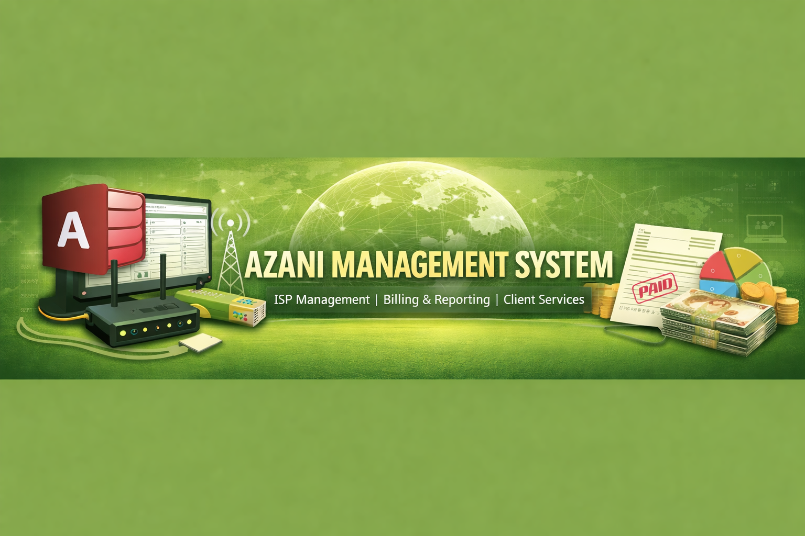

# Azani-Management-System
A fully functional Microsoft Access-based Information System designed to manage operations for an Internet Service Provider (ISP), handling everything from client onboarding to billing, infrastructure tracking, and service management.

  

# 🌐 Azani Management System (MS Access)
A fully functional Microsoft Access-based Information System designed to manage operations for an Internet Service Provider (ISP), handling everything from client onboarding to billing, infrastructure tracking, and service management.

---

## 📌 Project Overview

The **Azani Management System** is built to streamline the day-to-day operations of an ISP company serving institutions such as schools and colleges.
From the moment a client requests internet services to installation, infrastructure setup, and monthly billing — this system acts as the central brain 🧠 coordinating it all.

---

# ⚙️ Core Features

## 🧾 Client & Institution Management

* Register institutions (schools, colleges, etc.)
* Capture key details:
*  Institution name
*  Category (Primary, Secondary, College)
*  Contact information
*  Track registration fee payments (KSh 8,500)

---

## 🌍 Internet Service Management

Assign internet packages based on bandwidth: 

* 4 Mbps
* 10 Mbps
* 20 Mbps
* 30 Mbps
* 50 Mbps
 
Automatically calculate monthly subscription costs

Maintain service history per client

---

## 🛠️ Installation & Readiness Assessment
* Record site visits for infrastructure evaluation
* Track:
  1. Number of users
  
  2. Availability of computers
  
  3. LAN readiness
  
* Handle installation approval workflow
* Apply installation fee (KSh 10,000)

---

## 💻 Equipment & Infrastructure Sales
* Manage hardware sales:
  1. Computers (KSh 40,000 each)
  2. LAN Nodes (tiered pricing)
     
* Automatically calculate costs based on:
  1. Quantity
  2. Node ranges (e.g. 2–10, 11–20, etc.)
     
 ---
 ## 💰Billing & Payments
 * Track:
      1. Registration fees
      2. Installation fees
      3. Monthly subscription payments
    * Generate invoices and payment records
    * Maintain client payment history
 
 ---
  
  ## 📊 Reports & Insights
  * Generate structured reports such as:
    1. Active clients
    2. Revenue summaries
    3. Service distribution by bandwidth
    4. Equipment sales
  * Enable data-driven decision making 📈

 ---

  ## 🗄️ Database Design

   The system is built using relational database principles in MS Access, featuring:

   * Well-structured tables (Clients, Services, Payments, Equipment, Installations)
   * Relationships enforcing data integrity
   * Forms for user-friendly data entry
   * Queries for automation and logic
   * Reports for business insights

 ---

  ## 🖥️ Tech Stack
Microsoft Access
  * Forms (UI)
  * Queries (Logic)
  * Tables (Database)
  * Reports (Analytics)

 ---

 ##  🚀 How to Use
  1. Launch the Azani.accdb file
  2. Navigate through the dashboard/forms
  3. Start by:
     
  • Registering a new institution
  
  • Assigning internet services
  
  • Recording installation details
  
  4. Use reports to monitor performance and revenue

 ---

  ##  🎯 Project Objectives
  * Digitize ISP operations
  * Improve data organization and accessibility
  * Automate billing and service tracking
  * Provide actionable insights through reports
    
 ---

  ##  📸 Sample System Modules (Optional Section You Can Add Screenshots To)
  * Client Registration Form
  * Service Allocation Dashboard
  * Billing & Payment Interface
  * Reports Panel

 ---

## 💡 Future Improvements
* Integration with Power BI for advanced analytics
* Migration to a web-based system (ASP.NET / Django)
* Real-time payment integration (e.g. M-Pesa API)
* User authentication & role management

 ---

## 📚 Data Dictionary

* TABLES
  
  

* QUERIES
  
  

* FORMS
  
  

* REPORTS
  
  

### Relationships

---

## 📚 Sample Data Sets

---
## 📚 Sytem Layout (Interface)
### Forms (Interface)
* MAIN PAGE/Dashboard

* Onboarding Institutions

* Infrastructure Interface

* Installation services Interface

* Monthly Subscription Interface

* Band Width packages Interface

* LAN packages Interface

---

### Reports (Interfaces)

---

### 📜 Disclaimer

This project is for demonstration and portfolio purposes only.
Flash Logistics is a fictional company created for learning and development.

---
# 👨‍💻 Author
Elvis Mbaya
📊 Data Analyst | Power BI Developer | Systems Builder

###  🔗 Main GitHub Portfolio:
  https://github.com/elvisflash/elvisflash

 ---

### ⭐ Portfolio Value

If you find this project useful, feel free to star ⭐ the repository.

